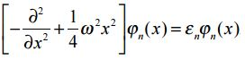
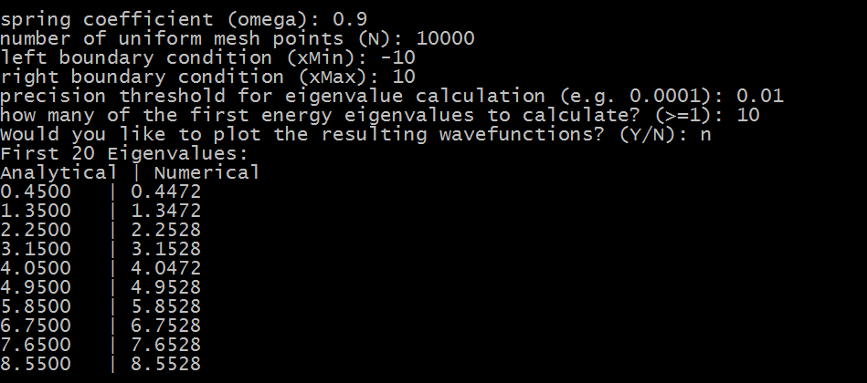

Here's my submission for a project in my Advanced Computational Physics class (33-456). In this code, I use the Numerov method, together with the shooting method, for solving the energy eigenvalues of the following 1D Schroedinger equation:

We've already got an analytical solution: ( n + 0.5) * hbar * omega for n = 0, 1, 2, ...,

For this assignment, I didn't encounter any problems with the shooting method that didn't exist with the matching method as well.

# Dependencies:
Python 3, numpy
matplotlib not necessary, but you can use it for some pretty plots!

To run the code, type the following into the command line:

`python numerov.py`

You'll be prompted for some input. Below is an example:

If you respond with a `y` to the prompt for plots, you should get plots that look like this:

